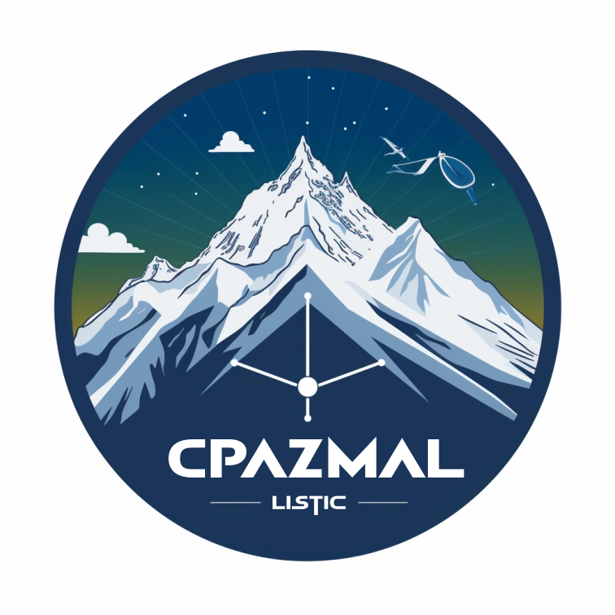

# PAZ-unsupervised

<!-- PROJECT LOGO -->
<br />
<div align="center">
  
  </a>
  <h1 align="center">Cryosphere PAZ satellite MAchine Learning</h1>
  <p align="justify">
  Satellite imagery plays a pivotal role in unraveling the complexities of Earth's landscapes, and our project is dedicated to curating a comprehensive reference dataset sourced from the PAZ satellite's X-band images over the Massif du Mont Blanc region. The advantages lie in the detailed spatial resolution of the X-band, enabling nuanced analysis, while considerations involve addressing atmospheric conditions for accurate interpretation. Leveraging the unique perspective offered by PAZ's X-band, our project aims to create an extensively annotated dataset, fostering advancements in environmental monitoring and climate studies. We focused on cryospheric surfaces—encompassing ablation zones, accumulation zones, ice aprons, and hanging glaciers—the dataset also captures conventional land cover types, including urban areas, forests, plains, and rocky terrain. Through baseline classification experiments, employing  K-nearest neighbors (KNN) for supervised learning, we seek to provide insights into the intricacies of land cover classification in this high-resolution satellite imagery. In a nutshell, our project simplifies access to diverse satellite data, shedding light on the unique features of the Massif du Mont Blanc region, from icy terrains to familiar landscapes, providing a useful tool for a further range of studies and applications.
  </p>
  <br />
</div>

Reference:
    
    Suvrat Kaushik, Christophe Lin-Kwong-Chon, Matthieu Gallet, and Emmanuel Trouvé, Monitoring the cryosphere of Mont-Blanc massif (Western
    European Alps) with X-band PAZ SAR image time-series. ..., .., .... https://doi.org/....../
  
  Dataset: 

    <https://zenodo.org/records/10401360>

<!-- TABLE OF CONTENTS -->
<details>
  <summary>Contents</summary>
  <ol>
    <li>
      <a href="#introduction">Introduction</a>
      <ul>
        <li><a href="#libraries">Libraries</a></li>
      </ul>
    </li>
    <li>
      <a href="#démarrage">Start</a>
      <ul>
        <li><a href="#prerequisites">Prerequisites</a></li>
        <li><a href="#installation">Installation</a></li>
      </ul>
    </li>
    <li><a href="#utilisation">Use case</a></li>
    <li><a href="#feuille-de-route">Roadmap</a></li>
    <li><a href="#contribution">Contribution</a></li>
    <li><a href="#license">License</a></li>
    <li><a href="#contact">Contact</a></li>
    <li><a href="#remerciements">Acknowledgments</a></li>
  </ol>
</details>
<br />

<!-- ABOUT THE PROJECT -->
## Introduction
  
...

<p align="right">(<a href="#readme-top">back to top</a>)</p>

### Libraries

[](https://docs.h5py.org/en/stable/release.html)
[](https://joblib.readthedocs.io/en/latest/)
[](https://matplotlib.org/stable/users/prev_whats_new/whats_new.3.3.3.html)
[](https://numba.pydata.org/numba-doc/latest/release-notes.html)
[](https://numpy.org/doc/stable/release/1.23.1-notes.html)
[](https://openpyxl.readthedocs.io/en/stable/)
[](https://pandas.pydata.org/pandas-docs/stable/whatsnew/index.html)

[](https://pillow.readthedocs.io/en/stable/releasenotes/9.0.1.html)
[](https://pyclustering.github.io/docs/0.10.1/html/index.html)
[](https://scikit-image.org/docs/stable/release_notes/0.18.3.html)
[](https://scikit-learn.org/stable/whats_new/v0.24.html)
[](https://github.com/tqdm/tqdm/releases)
[](https://tslearn.readthedocs.io/en/stable/whats_new/v0.5.html)


<p align="right">(<a href="#readme-top">back to top</a>)</p>

<!-- GETTING STARTED -->
## Start

Here are some sample instructions for setting up your project locally. To set up a local copy and get it running, follow these simple steps:

### Requirements

* Create and load a virtual environment

```sh
sudo apt install python3-virtualenv
python3 -m venv venv
source ./venv/bin/activate
#'deactivate' to close the virtual environment
```

* Activate the env
```sh
source ./[path_to_venv]/bin/activate # on linux based platform
.\[path_to_venv]\Script\activate.ps1 # on windows based platform
```

* Install requirements.txt
```sh
pip install -r requirements.txt
```

### Installation

Here's an example of how to install and configure the package.

1. Clone the repo

```sh
   git clone https://github.com/Matthieu-Gallet/PAZ-unsupervised.git
```

3. Navigate to the project directory and start the package.

```sh
   cd PAZ-unsupervised
   python code/create_dataset.py # Unit tests in progress ...
```

<p align="right">(<a href="#readme-top">back to top</a>)</p>


<!-- USAGE EXAMPLES -->
## Use cases

... Coming soon

<p align="right">(<a href="#readme-top">back to top</a>)</p>

<!-- ROADMAP -->
## Roadmap

* [x] Create the data loader.
* [ ] ...

See [open issues](https://github.com/LE2P/gda-python.git/issues) for a full list of features (and known issues).

<p align="right">(<a href="#readme-top">back to top</a>)</p>

<!-- CONTRIBUTING -->
## Contribution

Contributions are what make the open source community an extraordinary place to learn, inspire and create. All your contributions will be **very much appreciated**.

If you have a suggestion for improving this project, please fork the repo and create a pull request. You can also simply open an issue with the "enhancement" tag.
Don't forget to give the project a star! Thanks to all!

1. Create project
2. Create your feature branch (`git checkout -b feature/AmazingFeature`)
3. Commit your modifications (`git commit -m 'Add some AmazingFeature'`)
4. Push to branch (`git push origin feature/AmazingFeature`)
5. Ouvrir une demande d'extraction (Pull Request)


<p align="right">(<a href="#readme-top">back to top</a>)</p>


<!-- LICENSE -->
## License

Distributed under the ... license. See `LICENSE.txt` for more information. (Coming soon)

<p align="right">(<a href="#readme-top">back to top</a>)</p>

<!-- CONTACT -->
## Contact

- Suvrat Kaushik - <suvrat.kaushik@univ-smb.fr>
- Christophe Lin-Kwong-Chon - <christophe.lin-kwong-chon@univ-smb.fr>
- Matthieu Gallet - <matthieu.gallet@univ-smb.fr>
- Emmanuel Trouvé - <emmanuel.trouve@univ-smb.fr>

<p align="right">(<a href="#readme-top">back to top</a>)</p>

<!-- ACKNOWLEDGMENTS -->
## Acknowledgments

...
